# Darbu pārvaldības modulis (Yii2 Advanced + MSSQL + Docker)

Šis repozitorijs satur darbu pārvaldības sistēmu ar 3 moduļiem (Darbinieki, Būvobjekti, Darba uzdevumi) un API caurlaižu sistēmai. Projekts ir veidots ar **Yii2** un izmanto **MSSQL** datubāzi. Visa palaišana paredzēta **caur Docker**.

---

## Tehnoloģijas

- PHP (Docker konteinerī)
- Nginx (reverse proxy / web server)
- Yii 2 Framework
- MSSQL (Microsoft SQL Server 2022) 
- Composer
- Docker + Docker Compose
- Gii for view templates
- RBAC modified/adapted
- ..

---

## Projekta funkcionalitāte (prasību kopsavilkums)

### Backend **sysAdmin** : viss CRUD + user delete/restore

### 1) Darbinieku pārvaldības modulis
**Darbinieks**: vārds, uzvārds, dzimšanas datums, pieejas līmenis, loma, statuss (active/inactive).

Lomu tiesības:
- **Admin**: pievienot/rediģēt/deaktivizēt darbiniekus
- **Vadītājs (teamLead)**: redz sev pakļautos darbiniekus
- **Darbinieks (employee)**: redz informāciju par sevi

### 2) Būvobjektu modulis
**Būvobjekts**: atrašanās vieta, kvadratūra, nepieciešamais pieejas līmenis.

Lomu tiesības:
- **Admin**: CRUD būvobjektiem; CRUD uzdevumiem, kas saistīti ar būvobjektu
- **Vadītājs (teamLead)**: redz būvobjektus savā pārvaldībā + pieejamo darbu sarakstu tajos
- **Darbinieks**: redz būvobjektus, kuros viņam ir ieplānoti/izpildīti darbi

### 3) Darba uzdevumu modulis
**Darba uzdevums**: kurā būvobjektā, kuram darbiniekam, kādā datumā (un statusi).

Lomu tiesības:
- **Admin**: pievienot/rediģēt/dzēst darbus
- **Vadītājs (teamLead)**: CRUD uzdevumiem būvobjektos savā pārvaldībā
- **Darbinieks**: redz sev uzticētos uzdevumus

### 4) API caurlaižu sistēmai /TODO
API validē, vai darbiniekam konkrētajā datumā ir tiesības piekļūt konkrētam būvobjektam, balstoties uz **uzticētajiem uzdevumiem** (un pieejas līmeņa prasību).

---

## Palaišana ar Docker

### Prasības
- Docker
- Docker Compose

### Startēšana
* PHP konteiners izmanto starta skriptu(bash docker/php/init.sh), kas nodrošina, ka sistēma pēc docker compose up ir uzreiz lietojama, bez manuālām komandām. TRUNCATE ir ieslēgts, t.i. vecie dati tiek dzēsti pie katra konteineru starta.

* seeders izveido testa datus automātiski ar faker palīdzību (docker )
* Backend login: sysAdmin pw: admin123
* fake useru logins: username pw: user123+ID (janis.kalnins-12,pw: user12312)
```bash
docker compose up -d --build
```
Pēc tam:

* UI pieejams: http://localhost:8080 & http://localhost:8080/admin

* DB izveidota automātiski

* migrācijas izpildītas

* RBAC inicializēts

* testa dati izveidoti
   
## Aplikācijas lietotāja saskarne (UI)

### Pieteikšanās Frontend – darbinieku, projektu un uzdevumu pārvaldība
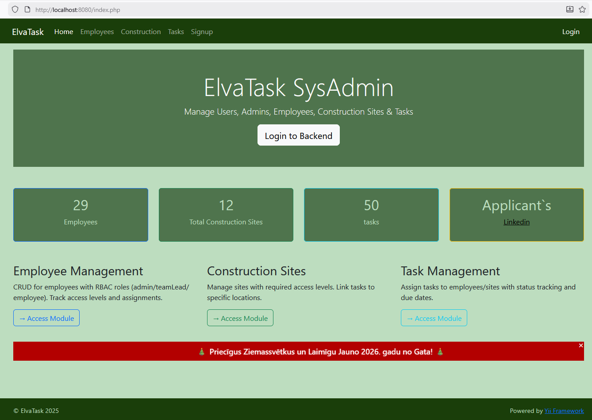

### Backend Admin panelis – lietotāju, darbinieku, projektu un uzdevumu pārvaldība
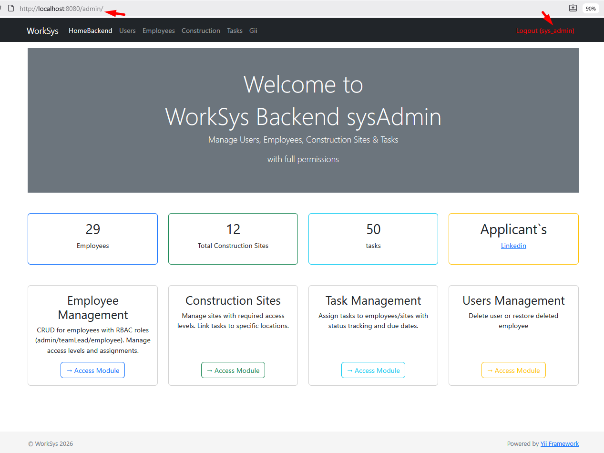

### FE darbinieku saraksts
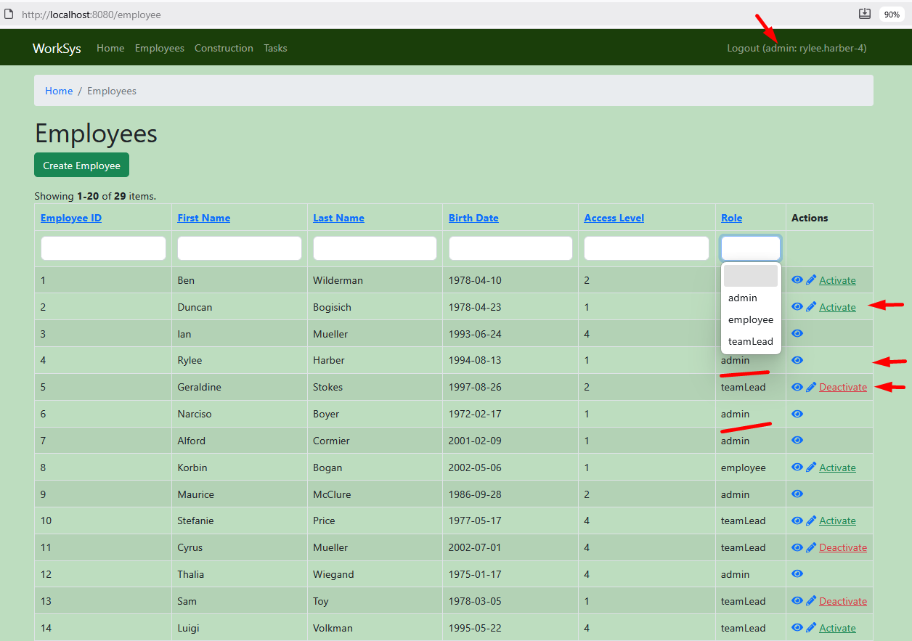

### FE darbinieku rediģēšana
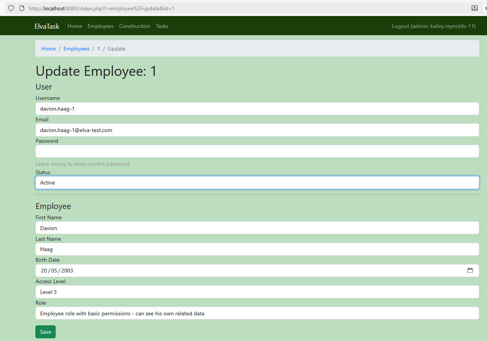

### FE Būvobjektu saraksts
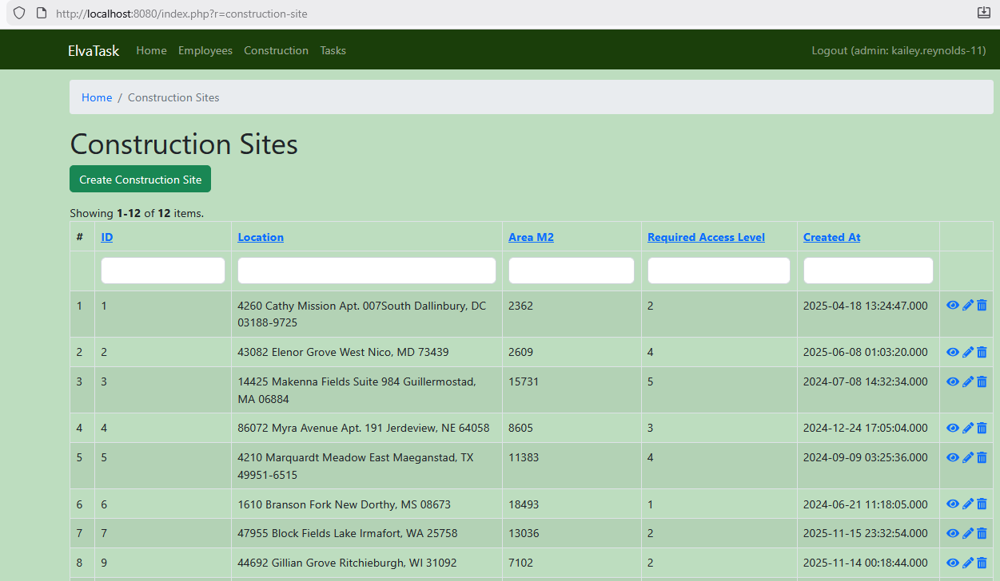

### FE Būvobjekta rediģēšana
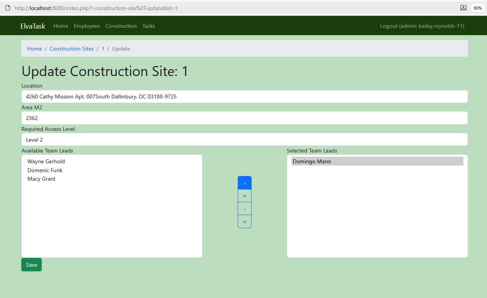

### FE Būvobjekta skats
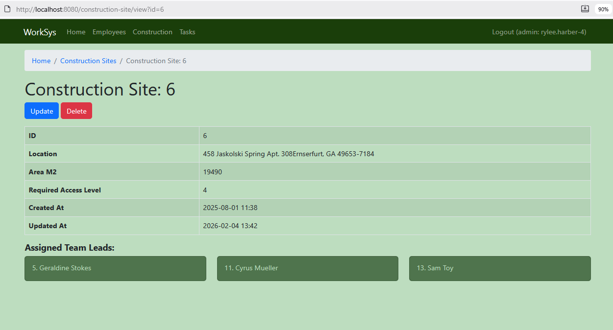

### FE Darba uzdevumu rediģēšana


### FE Darba uzdevumu saraksts
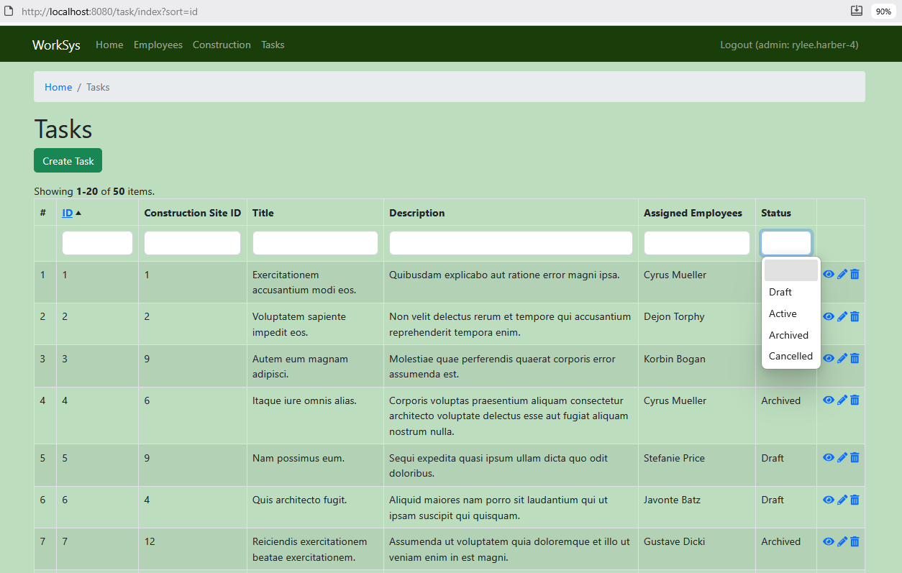

### FE Darba uzdevuma skats
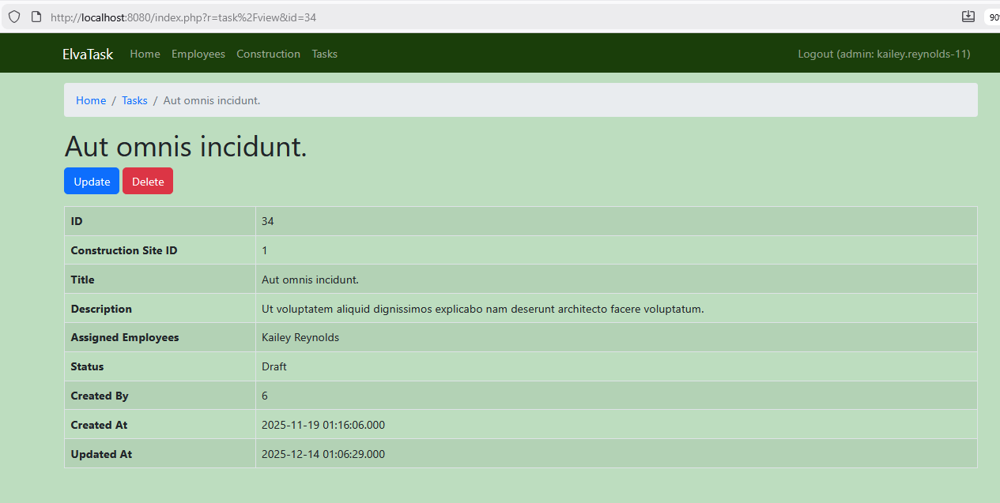

### BE lietotāju saraksts
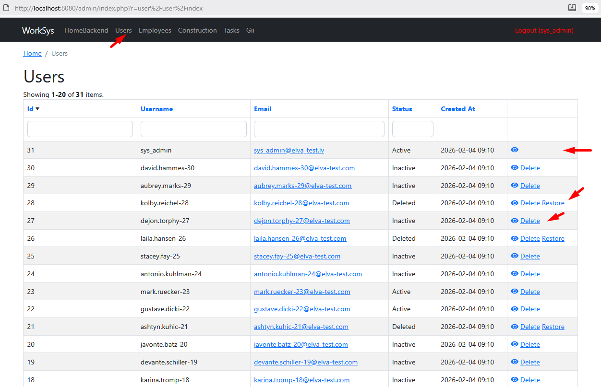

### BE darba uzdevumu saraksts
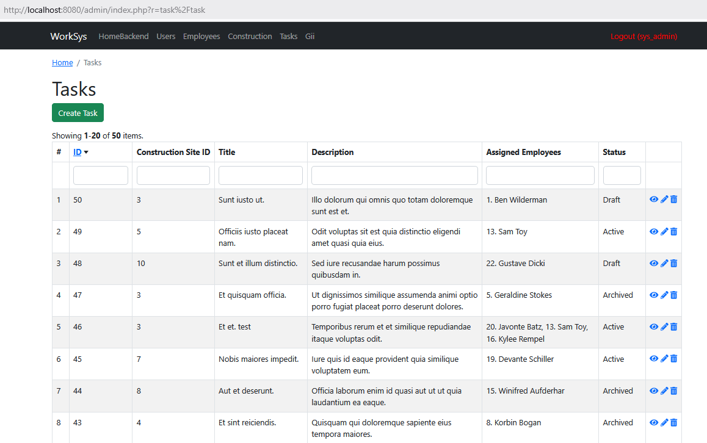

### BE Darba uzdevuma rediģēšana


### BE Darbinieku saraksts
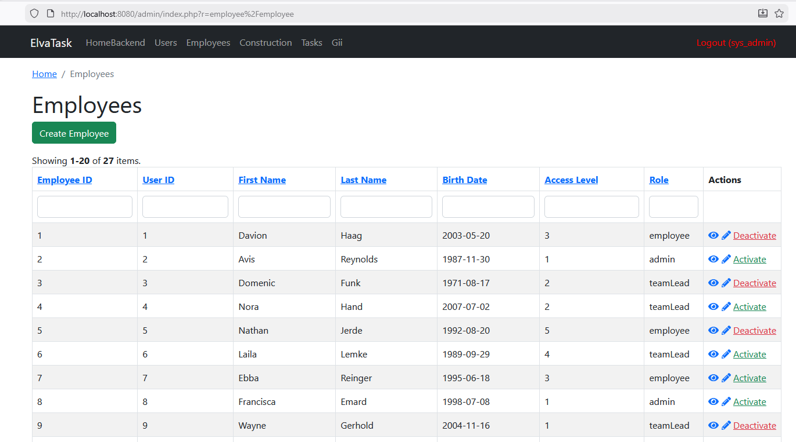

### BE darbinieka skats
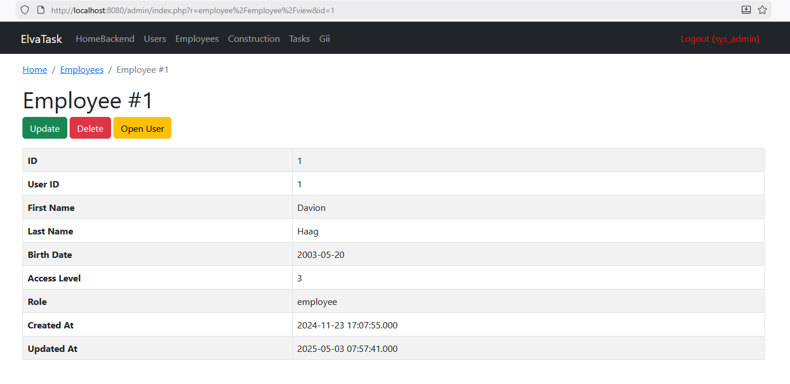

TODO: 
- Vizuāli uzlabojumi, lai ir vienots stils + popup logiem saskaņots modal logs
- New Role with permissions add no Backend sysAdmin
- Testi
- API
- Dokumentācija / Funkciju Anotāciju fix