# Darbu pārvaldības modulis (Yii2 Advanced + MSSQL + Docker)

Šis repozitorijs satur darbu pārvaldības sistēmu ar 3 moduļiem (Darbinieki, Būvobjekti, Darba uzdevumi) un API caurlaižu sistēma, kas balstas uz Darbinieka/Būvobjekta pieejas līmeni. Projekts ir veidots ar **Yii2** un izmanto **MSSQL** datubāzi. Visa palaišana paredzēta **caur Docker**.

---

## Tehnoloģijas

- PHP (Docker konteinerī php:8.2-fpm-bullseye)
- Nginx (reverse proxy / web server)
- Yii 2 Framework, izvēlējos advanced versiju, kur ir izdalīts Frontends, Backends, Common uc ar iespējamu individuālu konfigurāciju.
- MSSQL (Microsoft SQL Server 2022) 
- Composer
- Docker + Docker Compose
- Gii priekš skatu veidnēm
- RBAC modificēts/pielāgots mssql prasībām
- ..

---

## Projekta funkcionalitāte (prasību kopsavilkums)

### Backend **sysAdmin** : Darbinieku/Būvobjektu/Darba uzdevumu CRUD + user delete/restore

### 1) Darbinieku pārvaldības modulis
**Darbinieks**: vārds, uzvārds, dzimšanas datums, epasts, pieejas līmenis, loma, statuss (active/inactive/deleted). TODO: Lietotājam var būt vairāk nekā viena darbinieka loma.

Lomu tiesības:
- **SysAdmin (admin)**: Pievienot/rediģēt/deaktivizēt/aktivizēt darbiniekus + Dzēst/atjaunot darbinieku lietotāja kontu backendā. Nevar DZĒST sevi, ko ierobežo RBAC izveidots noteikums.
- **Admin (admin)**: Pievienot/rediģēt/deaktivizēt/aktivizēt darbiniekus FrontEnd pusē. Administrators nevar veikt izmaiņas sev un citiem administratoriem. Var tikai skatīt viņu profilu! To ierobežo RBAC noteikumi.
- **Vadītājs (teamLead)**: Darbinieks ar vadītāja lomu redz sev pakļautos darbiniekus.
- **Darbinieks (employee)**: Redz informāciju par sevi.

### 2) Būvobjekta modulis
**Būvobjekts**: Būvobjekts sastāv no informācijas par tā atrašanās vietu, platību kvadrātmetros un nepieciešamo piekļuves līmeni, atlasītajiem pieejamajiem komandas vadītājiem.

Lomu tiesības:
- **SysAdmin (admin)**: pilns CRUD būvobjektam.
- **Admin (admin)**: CRUD būvobjektiem; CRUD uzdevumiem, kas saistīti ar būvobjektu.
- **Vadītājs (teamLead)**: redz būvobjektus savā pārvaldībā + pieejamo darbu sarakstu tajos.
- **Darbinieks (employee)**: redz būvobjektus, kuros viņam ir ieplānoti/izpildīti darbi.

### 3) Darba uzdevumu modulis
**Darba uzdevums**: Uzdevums satur informāciju par to, kurš būvniecības projekts, kurš darbinieks un kad jāveic konkrēts darbs. Tam ir tādi informācijas lauki kā: būvlaukuma ID, nosaukums, apraksts, atbildīgie darbinieki, statuss (melnraksts, aktīvs, atcelts, arhivēts), kas izveidoja, izveidošanas datums, atjaunināšanas datums, plānotais sākuma datums, plānotās beigu datums, pabeigšanas datums.

Lomu tiesības:
- **Admin**: Darbinieks ar administratora lomu var pievienot/rediģēt/dzēst darbus, mainīt uzdevuma statusu, iestatīt sākuma/beigu/pabeigšanas datumu un laiku, iestatīt atbildīgos darbiniekus/vadītājus.
- **Vadītājs (teamLead)**: Darbinieks ar vadītāja lomu var pievienot/rediģēt/dzēst darba uzdevumus būvlaukumos tikai savā pārvaldībā. Var mainīt viņam piešķirtā uzdevumu piešķiršanas statusu (Piešķirts, Notiek izpilde, Pabeigts, Nokavēts, Atcelts).
- **Darbinieks**: Darbinieks bez papildu lomām var redzēt viņam piešķirtos uzdevumus. Var mainīt sev piešķirtā uzdevuma statusu (Piešķirts, Notiek izpilde, Pabeigts, Nokavēts, Atcelts).

### 4) API caurlaižu sistēma
API apstiprina, vai darbiniekam ir tiesības piekļūt konkrētai būvobjektam noteiktā datumā, pamatojoties uz **piešķirtajiem uzdevumiem** (un piekļuves līmeņa prasībām). Darbiniekam ir piekļuve būvlaukumam datumā D, ja:
- viņam ir piešķirts uzdevums
- uzdevums pieder būvlaukumam
- D ir starp plānoto_sākuma_datumu un plānoto_beigu_datumu
- darbinieka piekļuves līmenis ≥ nepieciešamais piekļuves līmenis
- Komandas vadītājs/darbinieks var piekļūt, ja viņš ir norīkots būvobjektam VAI viņam ir uzdevums šajā būvobjektā
- vai ja darbinieks ir sistēmas administrators vai administrators

---

## Palaišana ar Docker

### Prasības
- Docker
- Docker Compose

### Startēšana
* PHP konteiners izmanto starta skriptu(bash docker/php/init.sh), kas nodrošina, ka sistēma pēc docker compose up ir uzreiz lietojama, bez manuālām komandām. TRUNCATE ir ieslēgts, t.i. vecie dati tiek dzēsti pie katra konteineru starta.

* seeders izveido testa datus automātiski ar faker palīdzību (docker )
  Ģenerēto datu skaitu var mainīt šeit: \docker\php\init.sh.
* Backend logins: sysAdmin pw: admin123
* viltus lietotāju logins: username-id parole: user123+id (piemēram lietotājs: janis.kalnins-**12**,parole: user123**12**)
```bash
docker compose up -d --build
```
Pēc tam:

* UI pieejams: frontends http://localhost:8080 & backends http://localhost:8080/admin

* DB izveidota automātiski

* migrācijas izpildītas

* RBAC inicializēts

* Sistēmas Admin lietotājs izveidots

* testa dati izveidoti
   
## Aplikācijas lietotāja saskarne (UI)

### Pieteikšanās Frontend – darbinieku, projektu un uzdevumu pārvaldība


### Backend Admin panelis – lietotāju, darbinieku, projektu un uzdevumu pārvaldība


### FE Employee login
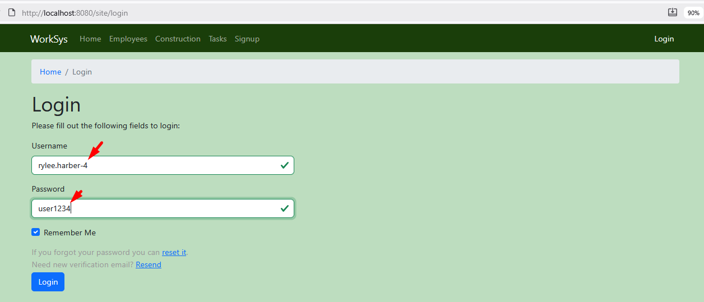

### FE darbinieku saraksts


### FE darbinieka skats
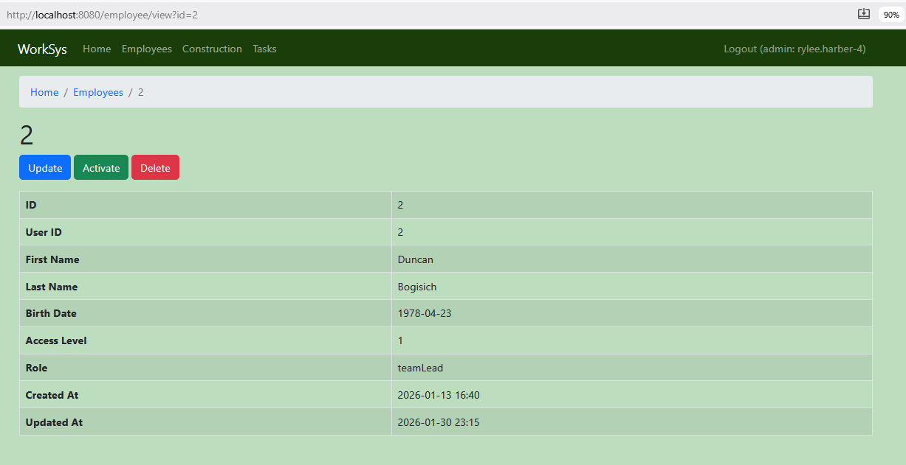

### FE darbinieku rediģēšana


### FE Būvobjektu saraksts


### FE Būvobjekta skats


### FE Būvobjekta rediģēšana


### FE Darba uzdevumu saraksts


### FE Darba uzdevuma skats


### FE sava uzdevuma skats ar iespēju mainīt savu uzdevuma statusu
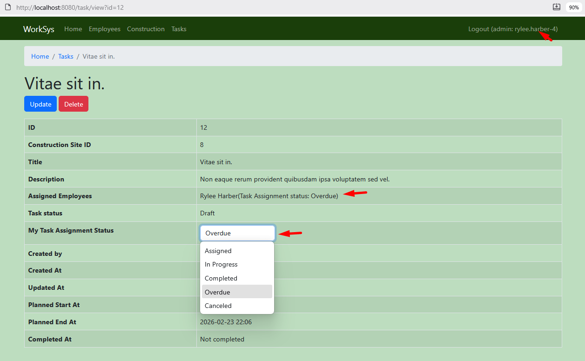

### FE Darba uzdevumu rediģēšana
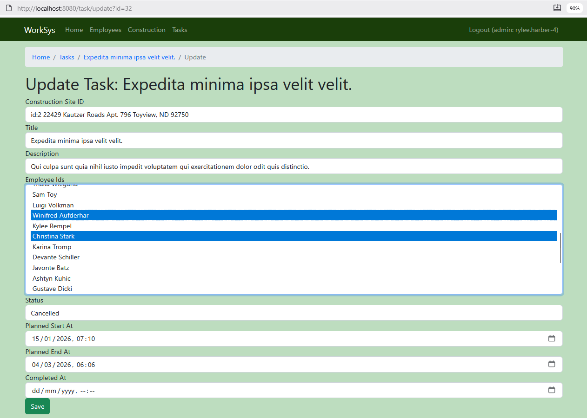

### BE lietotāju saraksts


### BE lietotāja skats
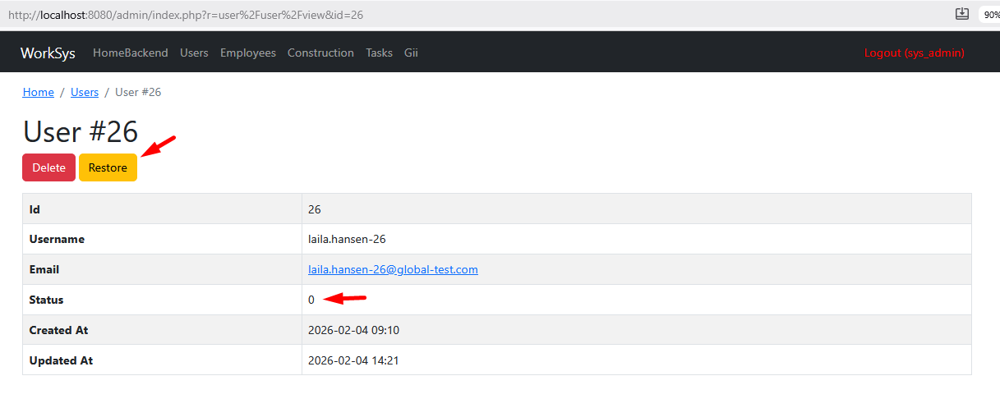

### BE darbinieku saraksts


### BE darbinieka skats
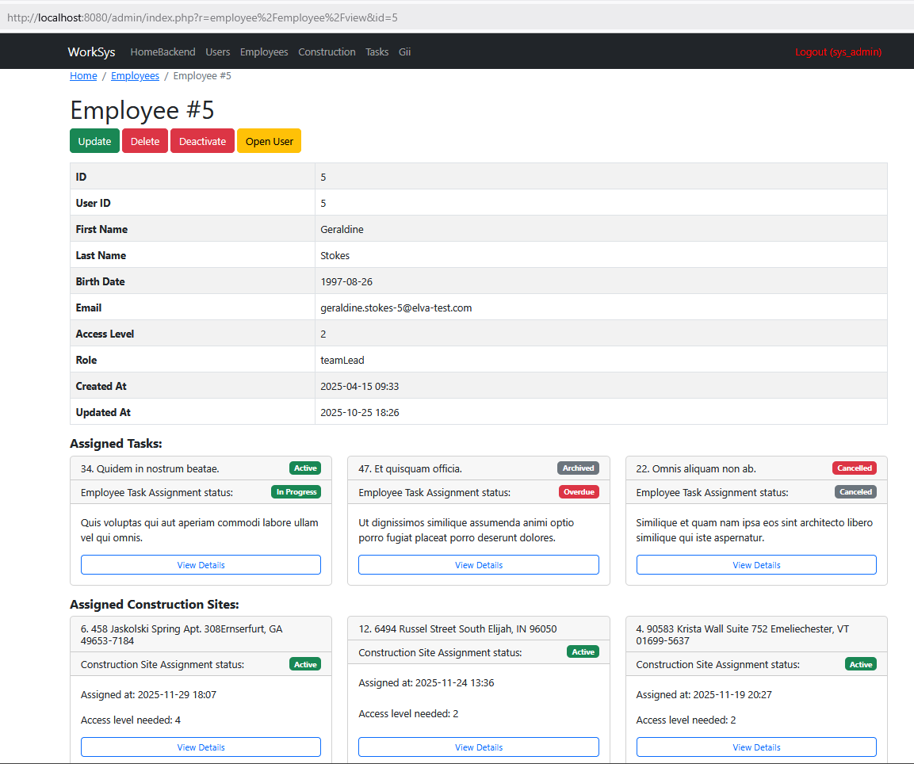

### BE darbinieka rediģēšanas skats


### BE Būvobjektu saraksts
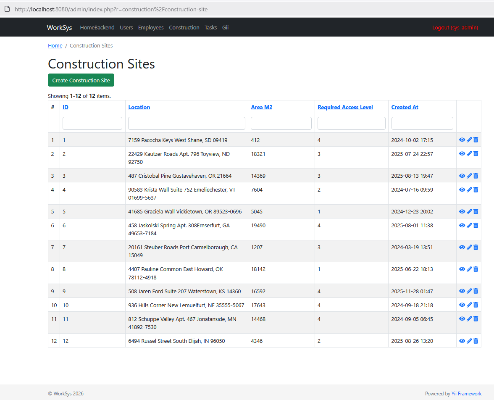

### BE Būvobjekta skats
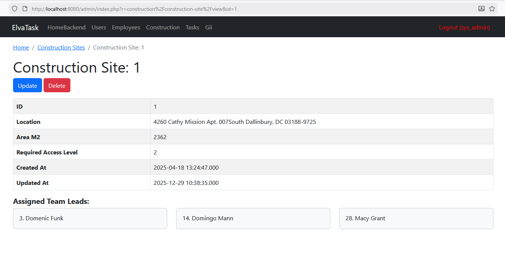

### BE Būvobjekta rediģēšana
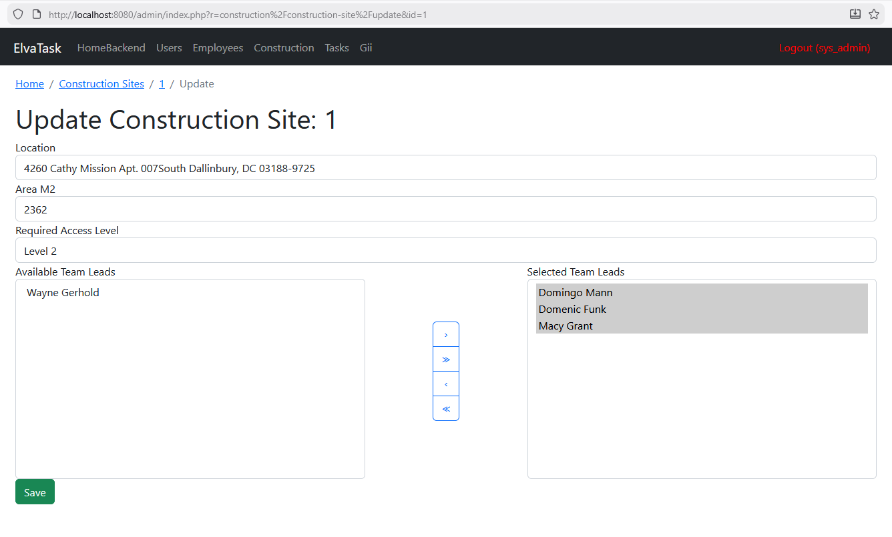

### BE darba uzdevumu saraksts


### BE uzdevuma skats
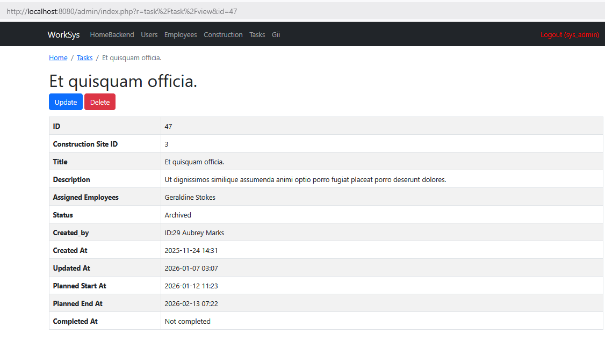

### BE uzdevuma rediģēšana
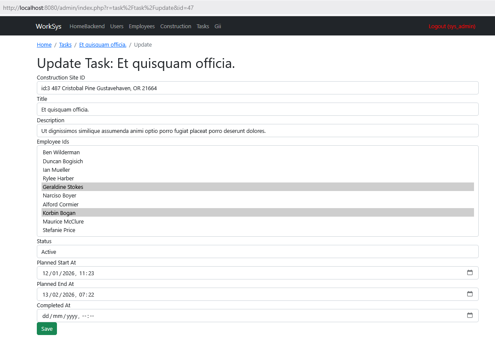


TODO: 
- Vizuāli uzlabojumi, lai ir vienots stils + popup logiem saskaņots modal logs
- Jaunu lomu ar atļaujām pievienošana no Backend sysAdmin
- Testi
- API V2 (pilns CRUD)
- Dokumentācija / Funkciju Anotāciju uzlabošana
- Fiksēti kolonnu nosaukumi/tabulas galvene tabulu sarakstiem, kad tiek rullēts uz leju
- Reģistrācijas labojums (nepieciešams pielāgot darbinieku modelim). Tas jau ir iespējams, taču pagaidām ir nepieciešama neliela viltība (nepieciešams dzēst un pēc tam atjaunot lietotāju no backend ar sistēmas administratora lietotāja atļaujām, jo ​​atjaunošana ietver darbiniekam nepieciešamos pamatlaukus).
- Pievienot opciju uzdevumu pievienošanai no FE būvbūvobjekta skata, kā arī parādīt atbilstošos pievienotos uzdevumus, būvlaukumus un to vadītājus ērtākai lietošanai (tāpat kā tagad administratora skatos).